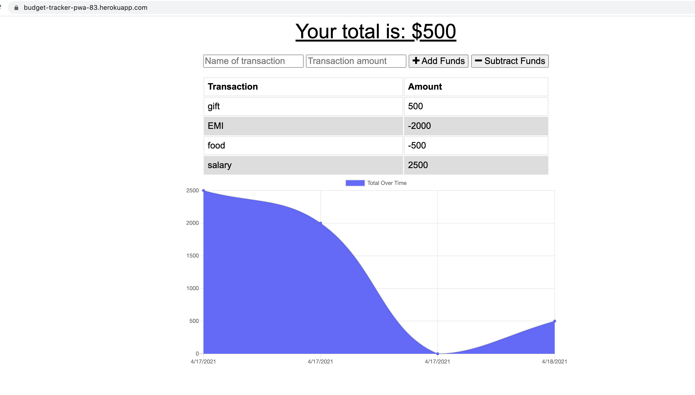
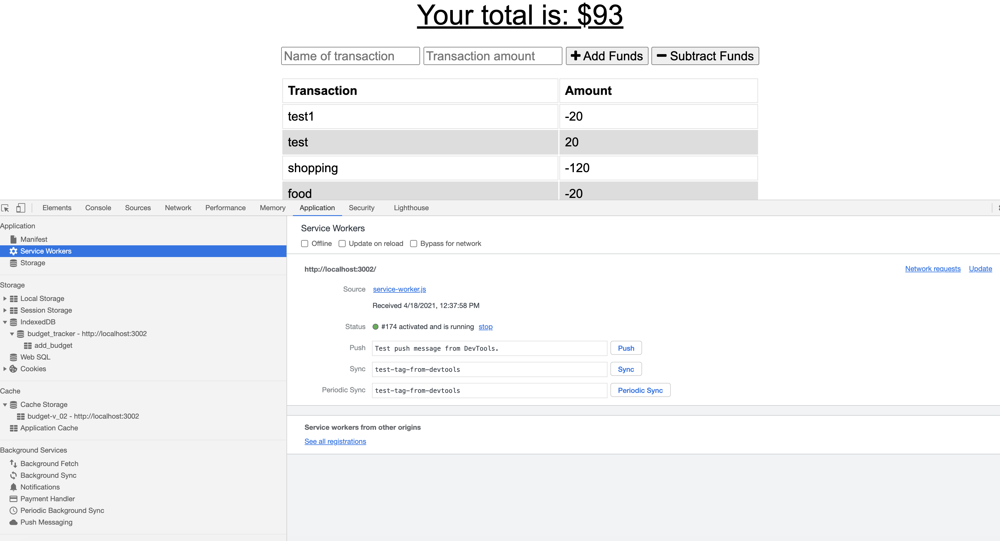
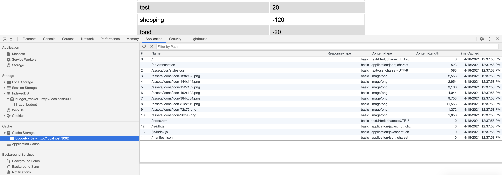

# Budget-Tracker

    Budget-Tracker is PWA (Progressive Web Apps) application where user can add their budget detail and see the curv that shows up and down of income and expense. Mainly PWA application allows user to perform operation even if they are not connected to internet (offline). As soon as user connects to internet / comes online It will perform actual transaction.

### Technology 
    - Mongoose api which help to connect Mongo DB
    - Mongo Db ( you can install mongo thru homebrew)
    - Node.JS
    - Express
    - MongoDB Atlas
    
    You also need to add Service Worker for caching.
    As this is a mobile-first application so we have used  web manifest for app metadata.
    This application is deployed on Heroku so MongoDB Atlas is used for MongoDB.

### Installation

To install dependencies, run the following command: 

```npm install```

This will install mongoose, express libraries which are used in project.

### Project Deployment / GitHub Details

To clone the project:
- SSH - git@github.com:bhumisha/Budget-Tracker_PWA.git
- HTTPS - https://github.com/bhumisha/Budget-Tracker_PWA.git
 
Project Source code : https://github.com/bhumisha/Budget-Tracker_PWA

This application is deployed on Heroku. PFB Heroku link
https://budget-tracker-pwa-83.herokuapp.com/

For testing this application, user has to set browser offline after loading the application, still he can perform budget tracker operations. after setting back to network to online, actual api call perfomed.

### Images

Home page



Service worker and caching data





### Questions
If you have any additional questions about the repo, open an issue or contact me directly at bhumishadave@gmail.com. You can fine more of my work at bhumisha